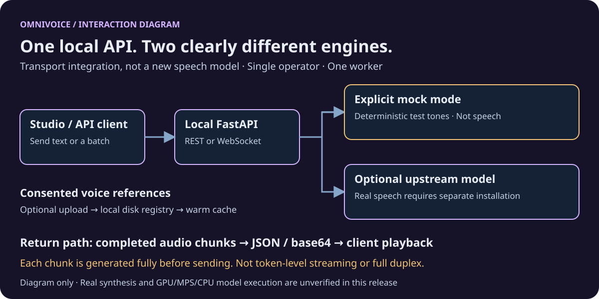

# OmniVoice Realtime + Studio

**Try a local speech API. Start with tones; bring a model only when ready.**

A FastAPI integration by **Jesús Pacheco / Akitá** for the independent
[OmniVoice project](https://github.com/k2-fsa/OmniVoice). The model and research
are by Han Zhu and collaborators—not the integration maintainer.
This repo adds REST/WebSocket transport, a reference registry, pronunciation
preparation and two Spanish-language Studio interfaces. No weights or voices ship.

For developers exploring local text-to-speech and consented voice references.
This is a **single-operator research tool**, not a hosted service or phone agent.

> **License boundary:** integration code is MIT; upstream code is Apache-2.0.
> The [model card](https://huggingface.co/k2-fsa/OmniVoice) states **CC-BY-NC**
> without specifying a version. MIT does not grant commercial model rights.
> Clarify exact model terms with upstream before redistribution or commercial use.



*Interaction diagram, not a screenshot, benchmark or genuine inference result.*

## What you can try

- Generate one audio packet, or a sequential batch of up to 20 requests.
- Send incremental text over WebSocket and receive completed audio chunks.
- Upload a consented reference, register its voice ID and warm it after restart.
- Prepare pronunciation with `es-latam-tech` or a custom dictionary.
- Explore basic Studio (`/ui`), the workbench (`/ui/pro`) and API schema (`/docs`).

**“Realtime” describes transport:** each chunk is fully generated before sending.
It is not token-level streaming, full duplex speech or WebRTC. Cancel clears
buffered text; it does not interrupt active inference.

## Start with the CPU-only mock

Requires **Python 3.11+**, pip and a virtual environment. No GPU, account,
PyTorch or model download is needed for this demo. From the source checkout:

```bash
python3 -m venv .venv
source .venv/bin/activate  # Windows: .venv\Scripts\activate
python -m pip install --upgrade pip
python -m pip install '.[dev]'
OMNIVOICE_MOCK=1 python -m uvicorn omnivoice_realtime.main:app --host 127.0.0.1 --port 8010 --workers 1
```

On PowerShell, set `$env:OMNIVOICE_MOCK="1"` before the Uvicorn command.
Open <http://127.0.0.1:8010/ui> or <http://127.0.0.1:8010/ui/pro>.
Mock mode produces deterministic **test tones, not speech**. It cannot prove
voice quality or cloning; mock health readiness is not real-model readiness.

## Send a first request

With the mock server running, in another terminal:

```bash
curl http://127.0.0.1:8010/health
curl http://127.0.0.1:8010/v1/tts -H 'Content-Type: application/json' \
  -d '{"text":"Hola mundo.","language":"Spanish","voice_mode":"auto","format":"wav"}'
```

The response is **JSON**, not a WAV file. Decode `audio_base64` to get audio.
In mock mode it contains a test tone, regardless of the sentence.
See the [API guide](docs/api.md) for voice uploads, PCM16 and WebSocket messages.

## Want real speech?

Use a **separate model environment** and accept upstream's noncommercial terms.
Install hardware-matched PyTorch/torchaudio before `.[omnivoice]`; follow the
[real synthesis setup](docs/setup.md#genuine-synthesis-separate-optional-installation).
Real startup loads a model and may download weights; mock mode must be explicit.

**Not validated in this release:** real synthesis, GPU/MPS/CPU model execution,
ASR accuracy or audio quality. No measured minimum RAM/VRAM or latency guarantee.
Auto mode does not lock speaker identity; voice-design emotion control is not guaranteed.

## Privacy and consent

**Only use voices and recordings you have informed permission to use.**
Do not impersonate others or use this for fraud. Disclose synthetic speech where
appropriate. Software does not enforce consent or automatically delete data.
References/transcripts persist locally; the browser retains the chosen voice ID.
Keep storage private, outside the checkout, and clear browser storage on shared machines.

Bind to **loopback**, use **one worker**, and never share a registry between
untrusted users. No authentication, tenant isolation, quotas or rate limits ship.
Remote access needs an authenticated TLS proxy protecting **all routes**, including
WebSockets, plus firewall and request limits. See [Security](SECURITY.md).

## Documentation and license

- [Documentation index](docs/README.md) — complete reference, beyond the quick start.
- [Setup and configuration](docs/setup.md) — model environment, caches, variables.
- [API and transport](docs/api.md) — routes, references and WebSocket protocol.
- [Privacy, licensing and development](docs/privacy-and-development.md).
- [Contributing](CONTRIBUTING.md) · [Third-party notices](THIRD_PARTY_NOTICES.md).

Original integration code/tests/Studio assets are [MIT](LICENSE); model and
identity rights are separate. No model weights or model-data assets are redistributed.
